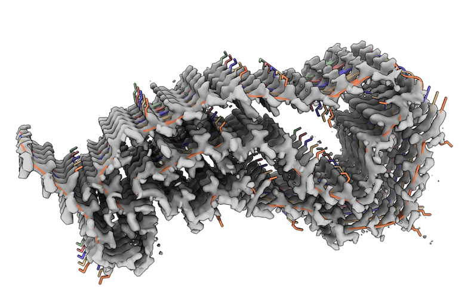

# EMMIVOX tutorials

  

This directory contains tutorials for single-structure (`1-refinement`) and ensemble refinement (`2-ensemble`) with EMMIVox.
These tutorials were part of [PLUMED Masterclass](https://www.plumed.org/masterclass) and are accompanied by two YouTube lectures:
- [lecture 1](https://www.youtube.com/live/6zGBxlx0qeE?feature=share): introduction to EMMIVox theory;
- [lecture 2](https://youtu.be/srZfm_TIgwc): step-by-step guide to the tutorials.

More advanced tutorials for model and ensemble refinement in presence of ordered waters (or lipids, ions, etc etc) are also provided (`3-refinement-wat` and `4-ensemble-wat`).
The system under study is a Tau filament resolved at 1.9 Angstrom by the Scheres group
 (PDB 7P6A, EMD 13223). The system is composed by 5 identical chains, for a total of 8335 solute atoms.
We will simulate the system using the CHARMM36m force field in explicit TIP3P water, for a total of 40958 atoms. The reference is:

[Shi, Y., Zhang, W., Yang, Y. et al. Structure-based classification of tauopathies. Nature 598, 359–363 (2021)](https://doi.org/10.1038/s41586-021-03911-7) 

**Note**: To do ensemble modelling you need to first complete the single-structure refinement tutorial.
